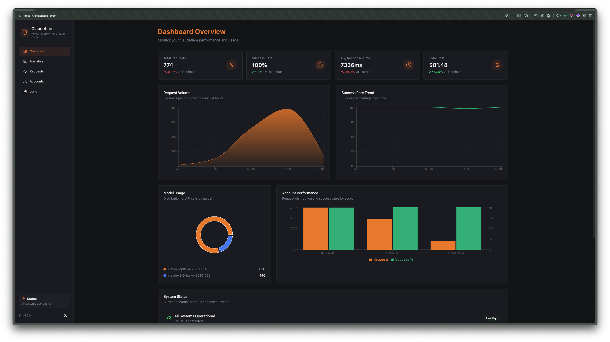

# ccflare 🛡️

**A multi-provider native proxy for Anthropic and OpenAI.**

ccflare routes each provider by URL prefix, load-balances across multiple accounts, and keeps full request history, rate-limit state, and usage analytics without translating provider payloads.



## Why ccflare?

- **Native passthrough** — Anthropic stays Anthropic, OpenAI stays OpenAI
- **Multi-provider routing** — route by `/v1/{provider}/*`
- **Compatibility routes** — route by `/v1/ccflare/*` with family-prefixed models
- **Account failover** — retry another account when one provider account is rate limited
- **Built-in observability** — dashboard, request history, analytics, logs, and health endpoints
- **Flexible auth** — API key and OAuth account support

## Quick start

```bash
git clone https://github.com/snipeship/ccflare
cd ccflare
bun install

# Start the server + dashboard on http://localhost:8080
bun run start

# Or launch the TUI, which can also start the server
bun run ccflare
```

Verify the server is up:

```bash
curl http://localhost:8080/health
```

## How routing works

ccflare proxies requests by provider prefix:

- `http://localhost:8080/v1/anthropic/*`
- `http://localhost:8080/v1/openai/*`
- `http://localhost:8080/v1/ccflare/*`

Examples:

- `/v1/anthropic/v1/messages` → `https://api.anthropic.com/v1/messages`
- `/v1/openai/chat/completions` → `https://api.openai.com/v1/chat/completions`
- `/v1/openai/responses` → `https://api.openai.com/v1/responses`

The `/v1/{provider}` prefix is stripped exactly once before forwarding upstream.

Compatibility routes keep the client-facing schema but select a provider family from
the `model` prefix:

- `openai/<model-id>` → prefers `codex`, then `openai`
- `anthropic/<model-id>` → prefers `claude-code`, then `anthropic`

Examples:

- `/v1/ccflare/openai/chat/completions` with `"model":"openai/gpt-5.4"`
- `/v1/ccflare/openai/responses` with `"model":"anthropic/claude-sonnet-4"`
- `/v1/ccflare/anthropic/messages` with `"model":"openai/gpt-4o-mini"`

## Account setup

### API key accounts

Add accounts through the management API:

```bash
curl -X POST http://localhost:8080/api/accounts \
  -H "content-type: application/json" \
  -d '{
    "name": "anthropic-main",
    "provider": "anthropic",
    "auth_method": "api_key",
    "api_key": "sk-ant-..."
  }'

curl -X POST http://localhost:8080/api/accounts \
  -H "content-type: application/json" \
  -d '{
    "name": "openai-main",
    "provider": "openai",
    "auth_method": "api_key",
    "api_key": "sk-openai-..."
  }'
```

### OAuth accounts

Use the CLI/TUI for interactive OAuth setup:

```bash
# Claude Code OAuth
bun run ccflare --add-account work --provider claude-code

# Codex OAuth
bun run ccflare --add-account codex --provider codex
```

The management API also exposes provider-specific auth endpoints:

- `POST /api/auth/anthropic/init`
- `POST /api/auth/anthropic/complete`
- `POST /api/auth/openai/init`
- `POST /api/auth/openai/complete`

## Provider configuration

### Anthropic clients

Point Anthropic SDKs or curl at the Anthropic-prefixed base URL:

```bash
export ANTHROPIC_BASE_URL=http://localhost:8080/v1/anthropic
```

### OpenAI clients

Point OpenAI-compatible clients at the OpenAI-prefixed base URL:

```bash
export OPENAI_BASE_URL=http://localhost:8080/v1/openai
```

You can configure both providers at the same time and ccflare will keep account selection isolated per provider.

## Example usage

### Anthropic example

```bash
curl -X POST http://localhost:8080/v1/anthropic/v1/messages \
  -H "content-type: application/json" \
  -d '{
    "model": "claude-3-7-sonnet",
    "max_tokens": 128,
    "messages": [
      { "role": "user", "content": "Say hello from ccflare." }
    ]
  }'
```

### OpenAI chat completions example

```bash
curl -X POST http://localhost:8080/v1/openai/chat/completions \
  -H "content-type: application/json" \
  -d '{
    "model": "gpt-4o-mini",
    "messages": [
      { "role": "user", "content": "Say hello from ccflare." }
    ]
  }'
```

### OpenAI Responses API example

```bash
curl -X POST http://localhost:8080/v1/openai/responses \
  -H "content-type: application/json" \
  -d '{
    "model": "gpt-4o",
    "input": "Summarize why provider-prefixed routing is useful."
}'
```

### ccflare compatibility example

```bash
curl -X POST http://localhost:8080/v1/ccflare/openai/chat/completions \
  -H "content-type: application/json" \
  -d '{
    "model": "anthropic/claude-sonnet-4",
    "messages": [
      { "role": "user", "content": "Say hello from the compatibility route." }
    ]
  }'
```

## Management API

Key endpoints:

- `GET /health` — status, account count, strategy, supported providers
- `GET /api/accounts` — list accounts
- `POST /api/accounts` — create an account
- `PATCH /api/accounts/:id` — update an account (rename, change `base_url`)
- `DELETE /api/accounts/:id` — remove an account
- `POST /api/accounts/:id/pause` / `resume` — exclude or restore an account
- `POST /api/accounts/:id/rename` — rename an account
- `GET /api/requests` — recent request summaries
- `GET /api/requests/detail` — detailed request info with payloads
- `GET /api/requests/stream` — live request stream via SSE
- `GET /api/analytics` — aggregated analytics
- `GET /api/stats` — usage and performance stats
- `POST /api/stats/reset` — reset usage statistics
- `GET /api/logs/stream` — live server logs via SSE
- `GET /api/logs/history` — historical log entries
- `GET /api/config` — current configuration
- `GET /api/config/strategy` — current load balancing strategy
- `POST /api/config/strategy` — update load balancing strategy
- `GET /api/strategies` — list available strategies
- `GET /api/config/retention` — data retention settings
- `POST /api/config/retention` — update data retention settings
- `POST /api/maintenance/cleanup` — run data cleanup
- `POST /api/maintenance/compact` — compact the database

## UI and developer tools

- **Dashboard:** `http://localhost:8080`
- **TUI:** `bun run ccflare`
- **Server only:** `bun run start`

## Requirements

- [Bun](https://bun.sh) >= 1.2.8
- Anthropic and/or OpenAI credentials

## Documentation

Additional repo docs live in [`docs/`](docs/):

- [Getting Started](docs/index.md)
- [Architecture](docs/architecture.md)
- [API Reference](docs/api-http.md)
- [Configuration](docs/configuration.md)
- [Load Balancing Strategies](docs/load-balancing.md)

## License

MIT — see [LICENSE](LICENSE).
