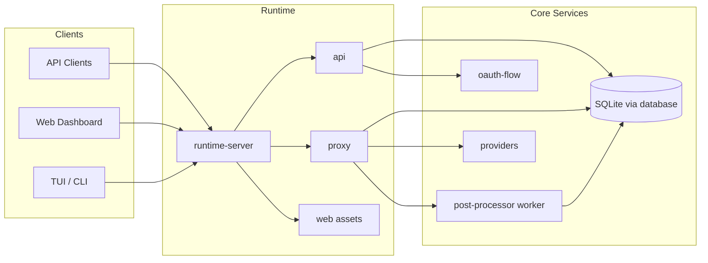
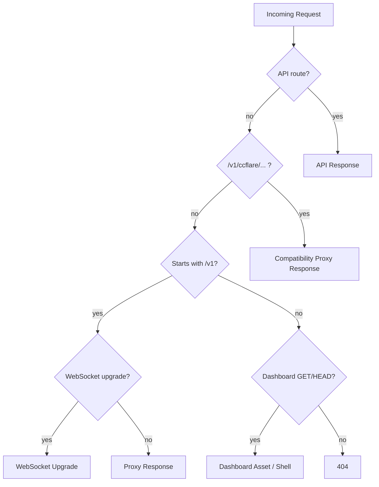
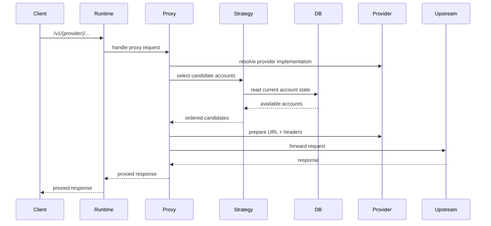

# Architecture

## Overview

ccflare is a Bun/TypeScript monorepo that:

- proxies provider-native HTTP and websocket APIs
- balances traffic across configured accounts
- persists request/account/auth-session state in SQLite
- exposes a management API plus browser and terminal UIs

The codebase is modular, but not framework-heavy. The runtime server is primarily an orchestration layer that composes smaller packages with narrow ownership.

## System Overview



## Workspace Layout

```text
ccflare/
├── apps/
│   ├── desktop/             # Desktop shell
│   ├── lander/              # Static landing page
│   ├── server/              # Main Bun server entrypoint
│   ├── tui/                 # Ink-based terminal UI
│   └── web/                 # Browser dashboard
├── packages/
│   ├── api/                 # REST and SSE handler layer
│   ├── config/              # Config loading, defaults, env overrides
│   ├── core/                # Constants, validation, DI, lifecycle, pricing
│   ├── database/            # SQLite schema, migrations, repositories
│   ├── http/                # Shared HTTP client/response/header utilities
│   ├── logger/              # Structured logging and log bus
│   ├── oauth-flow/          # OAuth account onboarding flow
│   ├── providers/           # Provider registry and provider implementations
│   ├── proxy/               # Forwarding, retries, event emission, worker handoff
│   ├── runtime-server/      # Runtime bootstrap, routing, lifecycle orchestration
│   ├── types/               # Shared domain/API types and guards
│   └── ui/                  # Shared presenters, display helpers, components
└── docs/
```

## Runtime Composition

`packages/runtime-server` is the composition boundary.

It currently owns:

- server bootstrap
- runtime graph construction
- Bun HTTP/WebSocket server startup
- request routing between API, proxy, and dashboard assets
- startup maintenance
- graceful shutdown

After the recent refactor, its internal modules are:

- `bootstrap-runtime.ts`
- `dashboard-assets.ts`
- `fetch-handler.ts`
- `startup-banner.ts`
- `startup-maintenance.ts`
- `index.ts`

### Runtime Startup Flow

```mermaid
graph TD
    START[startServer()]
    DASH[Preload dashboard assets]
    BOOT[bootstrapRuntime()]
    DB[DatabaseFactory.initialize + getInstance]
    WRITER[AsyncDbWriter]
    API[APIRouter]
    STRAT[SessionStrategy]
    PROXY_CTX[ProxyContext]
    MAINT[runStartupMaintenance]
    FETCH[createServerFetchHandler]
    BUN[Bun.serve]

    START --> DASH
    START --> BOOT
    BOOT --> DB
    BOOT --> WRITER
    BOOT --> API
    BOOT --> STRAT
    BOOT --> PROXY_CTX
    START --> MAINT
    START --> FETCH
    FETCH --> BUN
```

## Request Routing

Runtime routing is intentionally simple:

1. try `api` routes first
2. route `/v1/ccflare/...` compatibility traffic through the translation proxy
3. route `/v1/{provider}/...` traffic to the native provider proxy
4. route websocket upgrades for supported native provider paths
5. serve dashboard shell/static assets for browser GET/HEAD requests
6. return `404` otherwise

### High-Level Fetch Flow



## HTTP API Layer

`packages/api` owns the control-plane endpoints.

Main endpoint groups:

- health and runtime status
- account list/add/update/remove/pause/resume/rename
- OAuth init/complete/callback/session-status
- stats and analytics
- request summaries and request payload detail
- request-event streaming
- log streaming and log history
- config and strategy management
- cleanup and compaction actions

### Router Structure

`APIRouter` pre-instantiates handlers and registers:

- static routes in a map
- dynamic routes in a regex table

This keeps per-request overhead low while keeping route ownership centralized.

## Proxy Layer

`packages/proxy` owns the data-plane path.

Responsibilities:

- resolve provider from path
- select candidate accounts using the configured strategy
- forward HTTP and websocket traffic upstream
- refresh OAuth tokens when needed
- handle retry/failover
- emit request events
- normalize rate-limit metadata
- enqueue background post-processing for usage extraction and payload storage

### Proxy Flow



## Provider Layer

`packages/providers` owns provider-specific behavior.

What stays in provider implementations:

- route/base URL construction
- auth header preparation
- OAuth provider adapters
- refresh token behavior
- provider-native rate-limit parsing
- provider-specific usage parsing

Built-in providers:

- `anthropic`
- `openai`
- `claude-code`
- `codex`

The provider registry is the source of truth for:

- provider lookup
- OAuth provider lookup
- provider list used in banners and health responses

## OAuth Flow

`packages/oauth-flow` owns provider-scoped account onboarding.

Responsibilities:

- account-name collision checks
- PKCE generation
- auth URL construction through provider adapters
- auth-session persistence in `auth_sessions`
- auth-code exchange
- creation of OAuth-backed accounts

The HTTP API layer wraps this into `/api/auth/{provider}/...` endpoints and callback forwarding.

## Database Layer

`packages/database` owns:

- schema creation
- migrations
- repository classes
- async writer
- singleton database factory
- operational facade (`DatabaseOperations`)

Primary repositories:

- `AccountRepository`
- `RequestRepository`
- `AuthSessionRepository`
- `AnalyticsRepository`
- `StatsRepository`
- `StrategyRepository`

### Persistence Boundaries

The runtime persists:

- account configuration and live state
- request summaries
- full request/response payloads
- short-lived auth session state

The schema intentionally reflects current behavior only.

## Load Balancing

`packages/proxy` currently exposes the session strategy.

Its job is narrow:

- select accounts
- preserve session affinity
- avoid paused or rate-limited accounts

The strategy is injected into the proxy context and may be rebuilt when config changes.

## Background Processing

ccflare pushes expensive observability work off the hot request path.

Two main mechanisms:

- `AsyncDbWriter` for non-blocking DB writes
- proxy post-processor worker for stream/websocket usage extraction and payload handling

This keeps request forwarding responsive while preserving detailed monitoring data.

## User Interfaces

### Web Dashboard

`apps/web` is the browser UI served by the runtime server at the server root when enabled.

It consumes the same HTTP API used by automation and external tooling.

Main concerns:

- account management
- analytics and charts
- request inspection
- logs
- maintenance actions

### Terminal UI / CLI

`apps/tui` plus `apps/tui/src/core` provide:

- the interactive Ink UI
- non-interactive management commands
- local wrappers around the same management operations exposed by the runtime

## Shared Support Packages

### `packages/core`

Holds cross-cutting primitives:

- constants
- validation
- lifecycle/disposables
- pricing helpers
- domain-level formatting like `formatCost`

### `packages/types`

Canonical type ownership:

- domain types
- API payload types
- stream event shapes
- common guards such as `isRecord`

### `packages/http`

Provides:

- response helpers
- SSE helpers
- proxy header sanitization
- HTTP client utilities
- HTTP error types/helpers

## Design Rules

The current architecture follows a few practical rules:

- packages should export what they actually own
- the runtime server should orchestrate, not absorb business logic
- provider-specific behavior belongs in `providers`
- persistence behavior belongs in `database`
- management endpoints belong in `api`
- forwarding behavior belongs in `proxy`

That ownership discipline matters more than abstract purity. It keeps refactors local and lets tests target the right package boundary.
