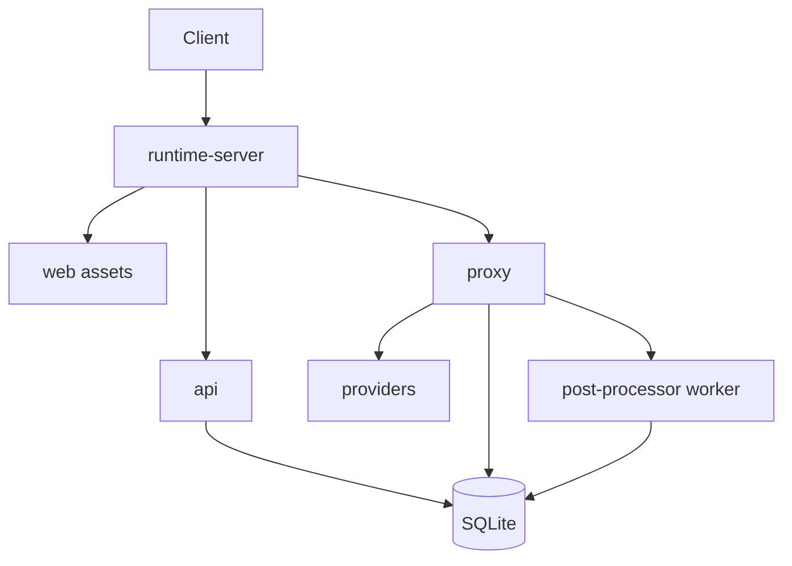
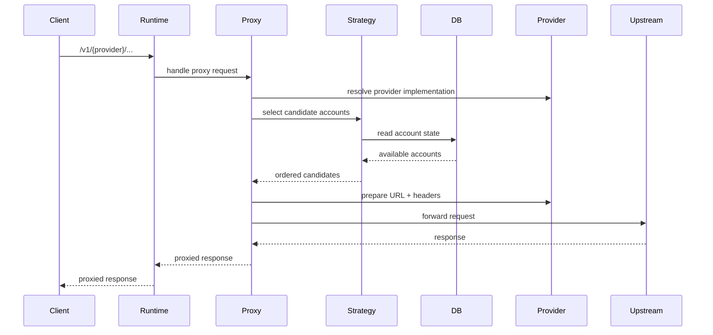
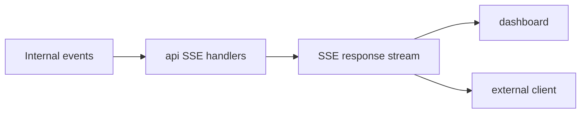
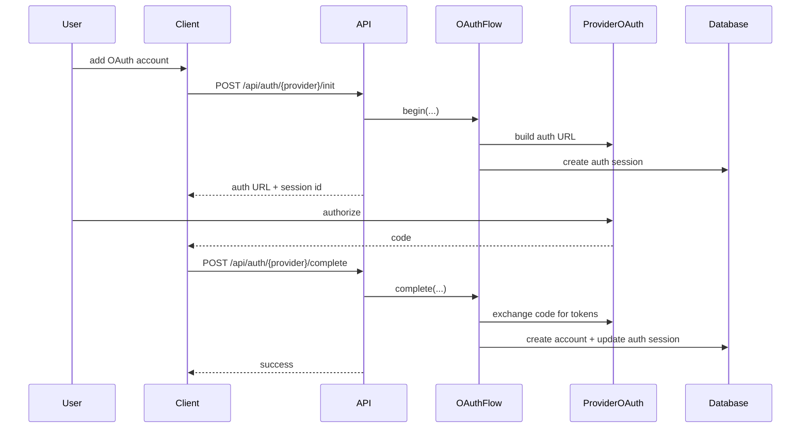
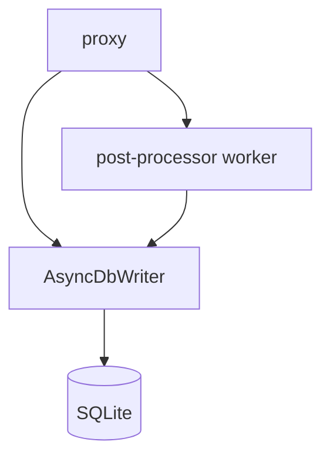

# Data Flow

## Overview

This document describes how requests and management operations move through ccflare today.

The major flows are:

- management/API requests
- proxied provider requests
- websocket proxy requests
- request/log event streaming
- OAuth account onboarding

## Runtime Flow



## HTTP Management Requests

Management endpoints follow this path:

1. request arrives at the Bun server
2. `runtime-server` sends it to `APIRouter`
3. a pre-instantiated handler performs validation and database/repository work
4. the handler returns JSON or SSE via `http`

Examples:

- `/health`
- `/api/accounts`
- `/api/stats`
- `/api/analytics`
- `/api/logs/stream`
- `/api/requests`

## Proxy Request Flow

Provider-native requests follow this path:

1. request arrives at `/v1/{provider}/...`
2. runtime server routes it to the proxy layer
3. proxy resolves the provider implementation
4. proxy/session strategy selects candidate accounts
5. provider prepares upstream URL and headers
6. request is forwarded upstream
7. response metadata is normalized
8. request events and persistence work are scheduled

### Proxy Forwarding Sequence



## WebSocket Flow

Websocket-capable provider routes go through the same runtime routing layer, but switch into the websocket proxy path when the request is an upgrade request.

```mermaid
flowchart TD
    REQ[Incoming /v1/{provider}/... request]
    UPGRADE{WebSocket upgrade?}
    WS[websocket proxy handler]
    HTTP[standard HTTP proxy path]
    UPSTREAM[Upstream provider]

    REQ --> UPGRADE
    UPGRADE -->|yes| WS
    UPGRADE -->|no| HTTP
    WS --> UPSTREAM
    HTTP --> UPSTREAM
```

## Response and Usage Processing

For HTTP proxy traffic:

- the proxy handles immediate forwarding concerns
- account/rate-limit state is updated
- request metadata is queued for persistence
- background post-processing extracts additional usage, payload, and summary information

For streaming and websocket traffic:

- the proxy emits chunk/summary payloads to the worker
- the worker parses provider-specific usage events
- final summaries and payloads are persisted asynchronously

## Event Streaming

ccflare exposes two real-time SSE streams:

- `/api/requests/stream`
- `/api/logs/stream`

### Event Streaming Flow



Request events come from the request-event bus; log events come from the log bus.

## OAuth Account Onboarding Flow

OAuth account onboarding is provider-scoped.



Important note:

- auth flow state is stored in `auth_sessions`
- callback forwarding is provider-scoped and managed by `api`

## Database Writes During Normal Operation

### `accounts`

Updated for:

- account creation
- token refresh
- request/session counters
- pause/resume state
- rate-limit metadata

### `requests`

Updated for:

- request metadata
- status and timing
- model selection
- token and cost analytics
- failover attempt counts

### `request_payloads`

Updated for:

- full request/response payload persistence
- debugging and request inspection

### `auth_sessions`

Updated for:

- OAuth onboarding state
- completion status transitions
- session expiry management

## Background Work

Background processing exists to keep the request path responsive.

The main mechanisms are:

- `AsyncDbWriter` for non-blocking writes
- the proxy post-processor worker for stream/websocket usage extraction

### Background Persistence Flow



This keeps forwarding latency low while preserving detailed observability.

## Design Summary

Today’s data flow is intentionally simple:

- `runtime-server` routes
- `api` manages the control plane
- `proxy` manages the data plane
- `providers` own provider-specific parsing/auth details
- `database` persists state and analytics inputs
- dashboard and TUI consume the same management surface
