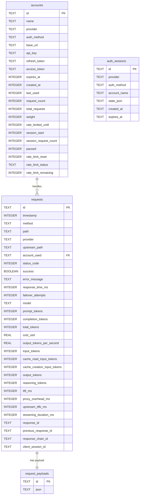
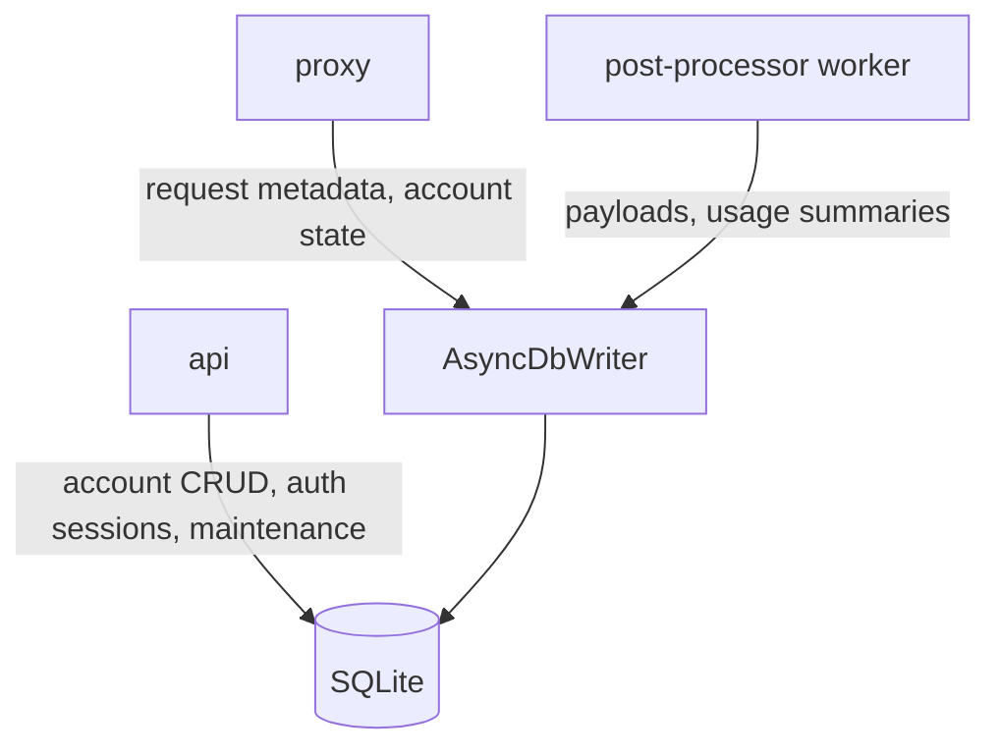

# Database

## Overview

ccflare uses SQLite as its only runtime datastore.

The database layer stores:

- configured accounts and account state
- request summaries
- full request/response payload documents
- short-lived OAuth auth sessions

The implementation lives in `packages/database` and is built around:

- Bun’s native SQLite bindings
- a repository pattern for query ownership
- an async write queue for background persistence
- migrations that normalize older schemas into the current shape

## Storage Model

## Core Tables

### `accounts`

Stores configured provider accounts plus live runtime state.

Important fields:

- `provider`: provider key such as `anthropic`, `openai`, `claude-code`, `codex`
- `auth_method`: `api_key` or `oauth`
- `weight`: selection weight used by the strategy layer
- `paused`: explicit operator-controlled pause flag
- `rate_limited_until`, `rate_limit_reset`, `rate_limit_status`, `rate_limit_remaining`: rate-limit metadata
- `session_start`, `session_request_count`: session-strategy bookkeeping
- `refresh_token`, `access_token`, `expires_at`: OAuth token lifecycle state

### `requests`

Stores request-level metadata for analytics, troubleshooting, and monitoring.

Important fields:

- `provider` and `upstream_path`: preserve resolved provider routing context
- `success`: nullable to distinguish in-flight from completed failures
- `failover_attempts`: retry/failover visibility
- token and cost fields: support analytics and UI summaries
- `reasoning_tokens`: preserves provider-reported reasoning-token data where available
- `ttft_ms`, `proxy_overhead_ms`, `upstream_ttfb_ms`, `streaming_duration_ms`: decompose latency for streaming and proxy troubleshooting
- `response_id`, `previous_response_id`, `response_chain_id`: track Responses API lineage without overloading session-level concepts
- `client_session_id`: stores provider/client session correlation such as Claude Code's `x-claude-code-session-id`

### `request_payloads`

Stores serialized request/response payload documents keyed by request id.

This is intentionally separated from `requests` so summary queries stay small and fast.

### `auth_sessions`

Stores provider-scoped OAuth onboarding state.

Important notes:

- state is persisted as `state_json`
- timestamps are stored as ISO strings
- rows are used during `/api/auth/{provider}/init`, callback handling, and `/complete`

## Repository Layer

The active repositories are:

- `AccountRepository`
- `RequestRepository`
- `AuthSessionRepository`
- `AnalyticsRepository`
- `StatsRepository`
- `StrategyRepository`

Each repository:

- owns its SQL
- maps rows into application shapes
- keeps query-specific logic out of the higher layers

## Access Facade

### `DatabaseOperations`

This is the operational facade used throughout the runtime.

Responsibilities:

- owns the SQLite connection
- initializes repositories
- exposes one unified API surface to the rest of the app
- implements `Disposable` for graceful shutdown

### `DatabaseFactory`

Singleton wrapper used by the runtime and TUI paths.

Responsibilities:

- store runtime config relevant to session behavior
- lazily create the shared `DatabaseOperations` instance
- register/unregister the DB instance with lifecycle management

### `AsyncDbWriter`

Background write queue used to avoid blocking request forwarding.

Typical uses:

- request metadata persistence
- token refresh persistence
- payload persistence and post-processing writes

## Migration Model

The migration system is normalization-oriented.

It:

1. ensures the base schema exists
2. upgrades older account/request layouts into the current schema
3. ensures the current `auth_sessions` table exists
4. drops tables/columns that are not part of the current runtime model

The authoritative source of truth is:

- `packages/database/src/migrations.ts`

## Indexing Strategy

Core indexes created by schema setup and performance-index migrations include:

- `idx_requests_timestamp`
- `idx_requests_timestamp_account`
- `idx_requests_model_timestamp`
- `idx_requests_success_timestamp`
- `idx_requests_account_timestamp`
- `idx_requests_cost_model`
- `idx_requests_response_time`
- `idx_requests_tokens`
- `idx_requests_response_id`
- `idx_requests_previous_response_id`
- `idx_requests_response_chain_timestamp`
- `idx_requests_client_session_timestamp`
- `idx_accounts_name`
- `idx_accounts_name_unique`
- `idx_accounts_paused`
- `idx_accounts_rate_limited`
- `idx_accounts_session`
- `idx_accounts_request_count`
- `idx_auth_sessions_expires`

These support the dominant access patterns:

- time-window analytics
- per-account and per-model aggregation
- account availability filtering
- auth-session expiry cleanup

## Runtime Write Paths

The most important normal write paths are:

1. account creation/update through API or TUI
2. request summaries written to `requests`
3. payload persistence written to `request_payloads`
4. auth-session state written to `auth_sessions`
5. token refresh, rate-limit, and session state written back to `accounts`

## Maintenance

The runtime performs one-shot startup maintenance:

- cleanup of old requests/payloads based on retention settings
- database compaction

Manual maintenance is also available through the HTTP API and dashboard:

- cleanup endpoint
- compact endpoint

Retention is configured separately for:

- request metadata
- request/response payloads

## Practical Guidance

- Use `migrations.ts` as the schema source of truth, not old diagrams or examples.
- Use repository files to understand how analytics and summaries are computed.
- Treat `DatabaseOperations` as the main app-facing API, and repositories as internal query owners.
