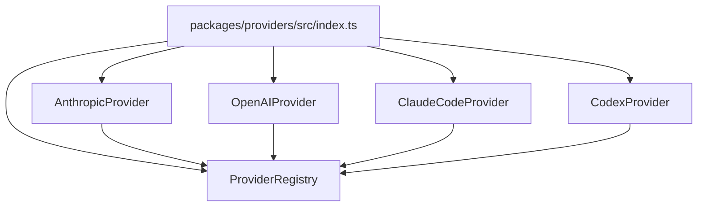
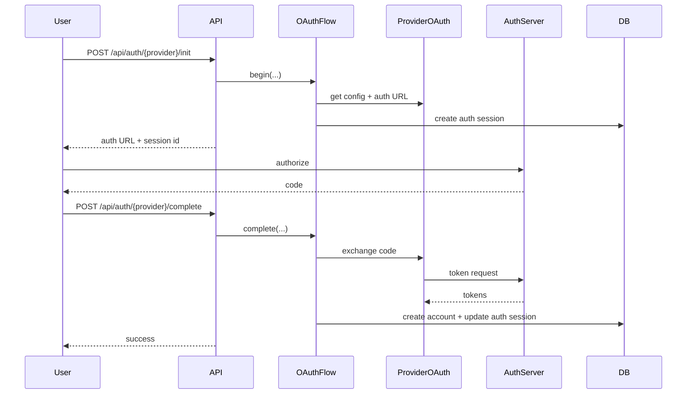

# Providers

## Overview

ccflare’s provider layer gives the rest of the system a consistent way to deal with multiple upstream APIs without collapsing all provider-specific behavior into the proxy.

`packages/providers` owns:

- provider registration and lookup
- provider-specific URL construction
- auth header preparation
- OAuth helper adapters
- refresh-token orchestration
- rate-limit parsing
- response/usage parsing helpers

## Built-In Providers

- `anthropic`
- `openai`
- `claude-code`
- `codex`

These are exposed through `/v1/{provider}/...` routes.

## Provider Registry

The registry is responsible for:

- registering providers
- resolving providers from route prefixes
- exposing provider lists for health and startup banners
- exposing OAuth-capable provider adapters

## Request Routing Model

The runtime proxy receives paths like:

- `/v1/anthropic/v1/messages`
- `/v1/openai/chat/completions`
- `/v1/claude-code/...`
- `/v1/codex/...`

Flow:

1. strip `/v1/{provider}` exactly once
2. resolve the provider implementation
3. select an account for that provider
4. delegate upstream URL/header behavior to the provider

## Authentication Modes

### API-Key Providers

- `anthropic`
- `openai`

These use `api_key` accounts and do not depend on refresh-token flows.

### OAuth Providers

- `claude-code`
- `codex`

These use provider-specific OAuth adapters plus the shared OAuth flow package. Access tokens may be refreshed automatically during forwarding.

## OAuth Flow Integration

The provider layer supplies:

- provider-specific auth URL logic
- token exchange logic
- refresh-token request details

## Provider Responsibilities

Each provider implementation owns:

- `buildUrl(...)`
- `prepareHeaders(...)`
- `parseRateLimit(...)`
- optional OAuth adapter hooks
- optional token refresh support
- provider-format-specific usage parsing

This keeps provider-specific protocol logic out of `runtime-server` and mostly out of `proxy`.

## Rate Limit Handling

Providers normalize native rate-limit signals into a shared shape consumed by the proxy/database layers.

Examples:

- Anthropic-family providers parse unified Anthropic rate-limit headers
- OpenAI parses OpenAI rate-limit headers when available
- Codex parses Codex-specific reset/usage headers

The proxy uses normalized rate-limit data to:

- mark accounts unavailable
- persist reset metadata
- avoid repeatedly selecting bad candidates

## Usage Extraction

Providers also own the provider-specific pieces of usage parsing.

That includes:

- non-streaming JSON usage parsing
- SSE response summary parsing where available
- cache-read/cache-write token fields
- reasoning-token fields where available

Heavy stream/websocket aggregation still happens in the proxy worker, but provider modules own the provider-specific parsing rules.

## Built-In Provider Notes

### Anthropic

- upstream base URL defaults to `https://api.anthropic.com`
- API-key authentication
- unified Anthropic rate-limit parsing

### OpenAI

- upstream base URL defaults to `https://api.openai.com/v1`
- API-key authentication
- OpenAI/responses usage parsing helpers

### Claude Code

- OAuth-based provider
- Anthropic-family request behavior
- refresh-token support

### Codex

- OAuth-based provider
- Codex-specific backend route handling
- custom headers and rate-limit parsing

## Adding a New Provider

To add one cleanly:

1. implement the provider class
2. implement OAuth helpers only if the provider needs OAuth
3. register it in `packages/providers/src/index.ts`
4. add provider metadata in `packages/types/src/provider-metadata.ts`
5. add tests for:
   - route resolution
   - headers
   - token refresh, if applicable
   - rate-limit parsing
   - usage extraction, if applicable

## Design Rule

Provider-specific facts belong in the provider layer or provider metadata, not in the runtime server.

That keeps:

- runtime orchestration generic
- proxy logic provider-agnostic where possible
- provider behavior easy to test in isolation
